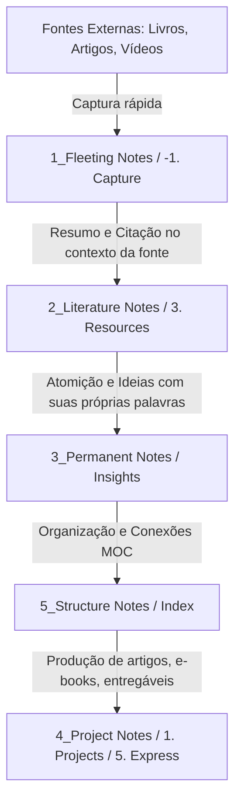

# 🗺️ Literature Map (Mapa de Literatura)

[[3. Resources/Zettelkasten/00_Zettelkasten_Hub\|Hub Zettelkasten]] | [[3. Resources/Zettelkasten/Zettelkasten Ontology/Zettelkasten Ontology\|Ontologia]] | [[3. Resources/Zettelkasten/Views/ARCO View\|ARCO]] | [[3. Resources/Zettelkasten/Views/Inspect View\|Inspect]]

> [!ABSTRACT] **Conceito / Concept**
> O **Literature Map** ilustra como fontes externas (Livros, Artigos, Podcasts, Vídeos, Documentos) são lidas, processadas em **Notas de Literatura (2_Literature)**, destiladas em **Notas Permanentes (3_Permanent)** com ideias próprias, organizadas via **Notas de Estrutura (5_Structure)** e finalmente aplicadas em **Projetos e Publicações (4_Project / 5. Express)**.

---

## 📸 Diagrama do Literature Map


*Documento em formato PDF disponível em: `<iframe src="/img/user/3.%20Resources/Zettelkasten/Assets/Zettelkasten_LitMap_2024-08-04.pdf" width="100%" height="900px" title="Zettelkasten_LitMap_2024-08-04.pdf" style="border:1px solid #ccc;"></iframe>`*

---

## ⚙️ O Fluxo passo a passo (Step-by-step Workflow)



### 1. Fontes (Sources)
- Fontes primárias: Livros (`#type/book`), Artigos, Vídeos, Podcasts, Manuscritos.
- Sempre manter a propriedade `based_on:: [[Link Da Fonte]]` nas notas derivadas.

### 2. Notas de Literatura (2_Literature Notes)
- Escrever resumos, citações (`#type/quote`), termos (`#type/term`) e pessoas (`#type/person`).
- Regra de Ouro: Escrever no **contexto da fonte** mantendo a fidelidade ao autor.

### 3. Notas Permanentes (3_Permanent Notes)
- Escrever ideias com **suas próprias palavras** (`#type/note`), perguntas (`#type/question`), prompts (`#type/prompt`).
- Regra de Ouro: **Uma ideia por nota** (Atomicidade) com raciocínio independente da fonte original.

### 4. Notas de Estrutura (5_Structure Notes)
- Mapas de Conteúdo (MOCs), Índices, Glosários e Visualizações ARCO.
- Conectam notas permanentes entre si criando uma rede de pensamento hipertextual.

### 5. Notas de Projeto / Saída (4_Project Notes)
- Rascunhos de artigos, posts do blog (`5. Express`), documentação de projetos (`1. Projects`).

---

## 🎨 Canvas Interativo

```json
![[Literature Map.canvas]]
```

---

## 📊 Notas de Literatura Recentes

| Nota de Literatura                                                                            | Autor/Fonte           | Criado em       |
| --------------------------------------------------------------------------------------------- | --------------------- | --------------- |
| [[3. Resources/Zettelkasten/Templates/Literature Note Template\|Literature Note Template]] | Nome do Autor / Fonte | August 26, 2026 |

{ .block-language-dataview}

---
*Retornar ao [[3. Resources/Zettelkasten/00_Zettelkasten_Hub\|Hub Zettelkasten]]*
